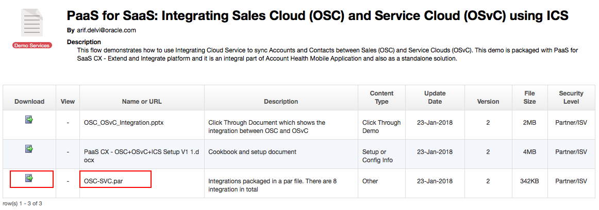
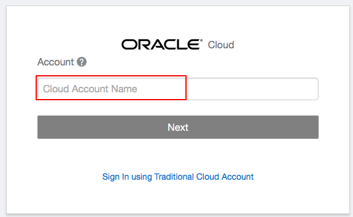
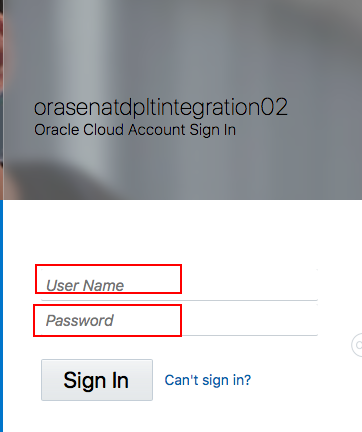
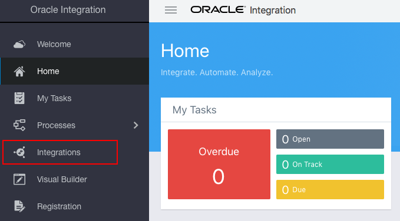
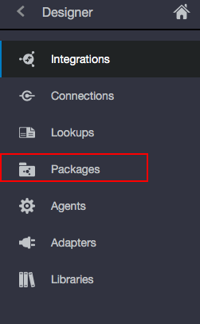
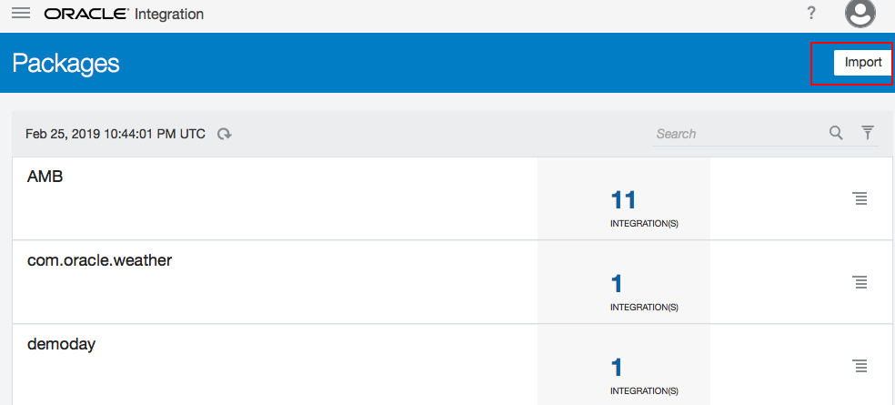
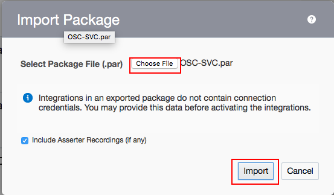

# LAB 100: Importing the OIC integration flows

### STEP 1: Open the link on <a href="https://demo.oracle.com/apex/f?p=DEMOSTORE:15:5169485753648:::15:P15_DOC_ID:28748" target="_video">Demo Central</a>, and download the OSC-SVC.par to your local computer
 
 
> **You can also download the Click Through Demo and Configuration docx for more information.**

### STEP 2: Sign in to the Oracle Integration Cloud Service instance
 

### STEP 3: On the Welcome page, click the Intergation icon

### STEP 4: On Integration page, click the Packages icon

### STEP 5: On the top right coner, click the Import Package button

### STEP 6: On Import Package File dialog box, browse the OSC_SVC.par and select it, then click Import Package

> **This creates all the integration flows contained within the package as well as the connections to Oracle Sales Cloud and Oracle Service Cloud. Next step is to configure the Oracle Service Cloud and Oracle Sales Cloud connections.**

================
Now, you are ready to [LAB 200](https://github.com/OracleCPS/OSC-SVC_UsingOIC/blob/master/LAB200.md)!

