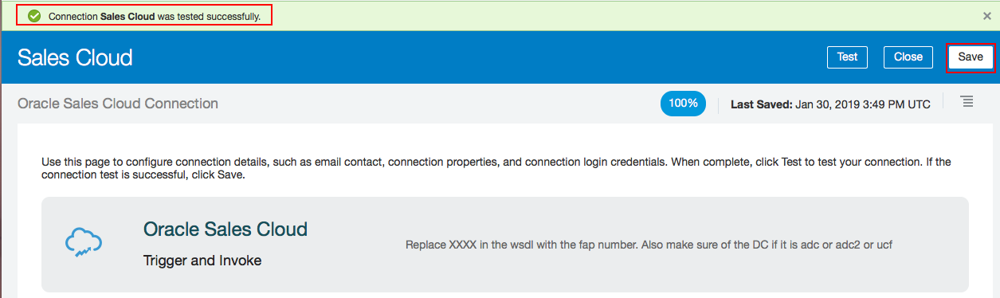

### LAB 200: Configuring the Connection to the Oracle Sales Cloud Instance

1. Click the hamburger menu at left, choose the Connections icon
 
  
 
2. On the Connections page, search for Oracle Sales Cloud and click on it for more details
 

3. Click the Configure Connectivity button and in the Connection Properties window, enter the values of Sales Cloud
 
 
4. when you finish, click OK.
 

5. Click the Security Configuration button, and in the Credentials window, enter the LogIn Credentials:
 
 
6. Click the Test icon on the Oracle Integration Cloud Service Connection Configuration page
 
 
7. When the status meter shows 100% Complete, click Save
 
 
8. Click the Exit button
 
 
