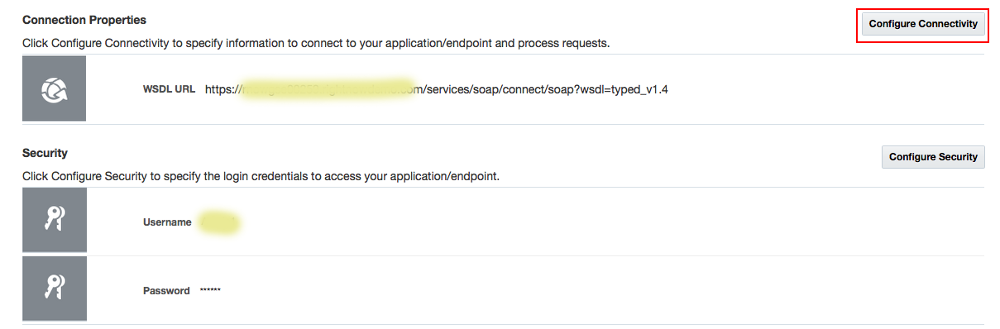
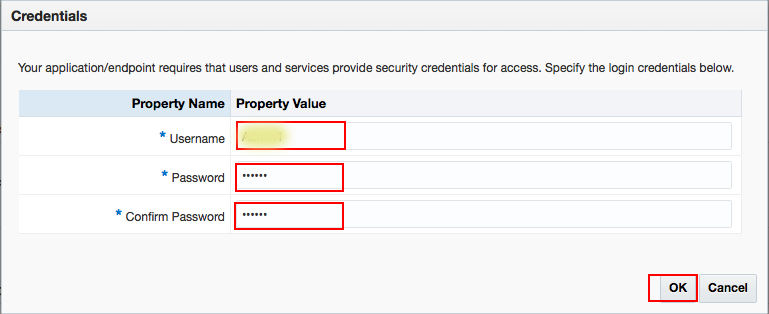
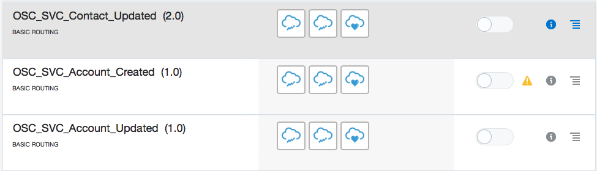

# LAB 300: Configuring the Connection to the Oracle Service Cloud Instance

After configuring the connection to the Oracle Sales Cloud instance, you then configure the connection to the Oracle Service Cloud instance.

### STEP 1: On the Connections page, search for Oracle Service Cloud and click it for more details

### STEP 2: Click the Configure Connectivity button and in the Connection Properties window, enter the values of Service Cloud

### STEP 3: when you finish, click OK

### STEP 4: Click the Security Configuration button, and in the Credentials window, enter the LogIn Credentials:

### STEP 5: Click OK.

### STEP 6: Click the Test icon on the Oracle Integration Cloud Service Connection Configuration page

### STEP 7: When the status meter shows 100% Complete, click Save

### STEP 8: Click the Exit button

