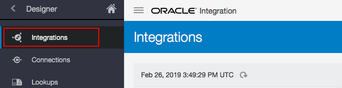
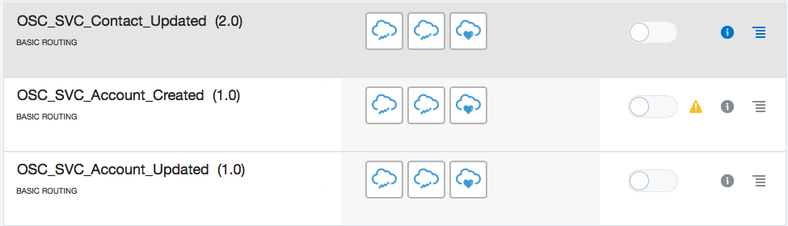
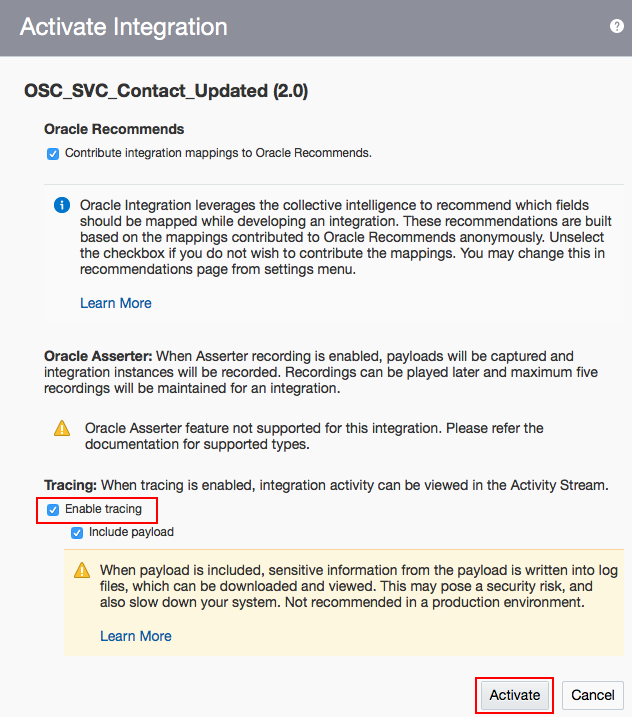

# LAB 400: Activating the Integration Package
> To activate the integration flows you must have successfully imported the OSC_SVC integration package and configured Oracle Sales Cloud and Oracle Service Cloud connections.

### STEP 1: Click Integrations icon on the left menu

### STEP 2: Locate OSC_SVC_CONTACT_CREATE, and click the Active button

### STEP 3: Check the Enable detail tracing check box and click the Active button on the confirmation dialog window

### STEP 4: Ensure the flow was activated successfully

### STEP 5: Repeat the active steps for the following integration flows:
OSC_SVC_ACCOUNT_CREATED
OSC_SVC_ACCOUNT_UPDATED
OSC_SVC_CONTACT_UPDATED

> After activation, verify that the integration synchronization is functional. Do this, for example, by creating or updating an account or contact record in the Oracle Sales Cloud. This action should automatically synchronize the record to Oracle Service Cloud. Additionally, create or update an organization or contact record in the Oracle Service Cloud. This action automatically synchronizes the record to Oracle Sales Cloud.

### STEP 6: Repeat the activate steps for the following integration flows in the Oracle Service Cloud-to-Oracle Sales Cloud direction
SVC_OSC_ORGANIZATION_CREATED
SVC_OSC_ORGANIZATION_UPDATED
SVC_OSC_CONTACT_CREATED
SVC_OSC_CONTACT_UPDATED

> Verify that the flows have been activated by signing in to Oracle Service Cloud and creating and updating organizations and contacts.
